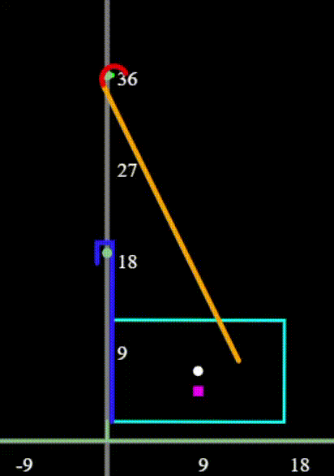

# Submersible Sim
Based off of the First Inspires Tech Challenge (FTC) 2024-2025 **INTO THE DEEP** game, this project attempts to simulate physics of a robot attempting a 3rd level ascent. The following properties are checked and simulated:

 * Gravity
 * Collision (robot-ground, robot-barrier, and hook-rung)
 * Actuators
 * User-to-robot Interaction and robot Response (aka. Teleop functions)

Through use of the teleop functions, the user can get the robot to a satisfactory position and enter into an automated raise mode. This attempts to keep the robot as vertical as possible while the user prompts actuation of the "hands."

## Known Issues
 * The hands are permanantly pinned to the low rung
 * Collision between hook and high rung is increasingly twitchy and unreliable at higher ascent heights. If too high, the hook can be ejected off of the rung
 * No collision detection for arm (expect the hook). The arm can pass through anything it likes
 * Leaving the tab while unpaused causes sudden and unexpected motion